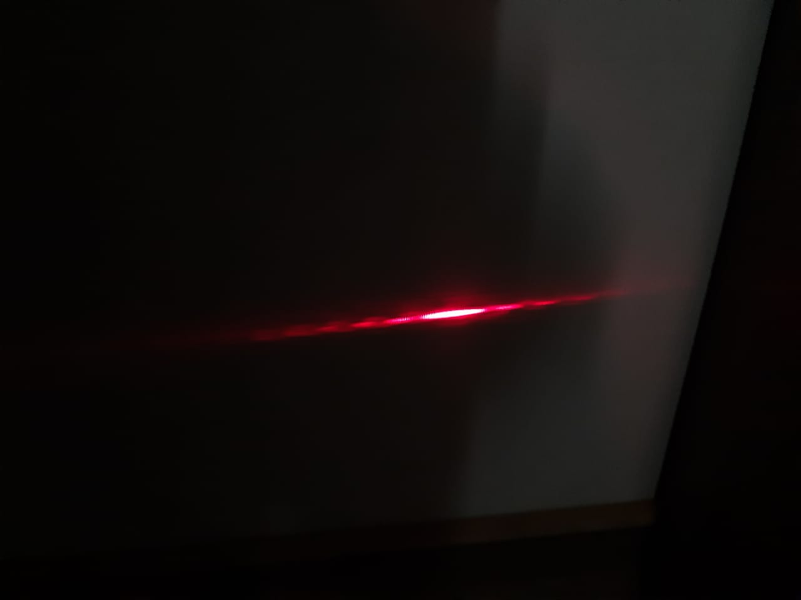

# CNYT-2020-2
# Double Slit Experiment

The double slit experiment is one of the most important experiments to introduce the fundamentals of quantum mechanics
and start to let the classic explications behind this ones.

This experiment was first introduced by Thomas Young in 1801 for understanding the wave behavior of the light but giving
new theories about the quantum mechanics, the interference and the possibilities of a particle to be in two spaces at the same time.

## Materials

For this experiment were used:

- Aluminium foil.
- Two small boxes.
- A laser.
- Tape
- An scalpel.

## Steps

1. Take a piece of aluminium foil and cut two small lines as close as possible.
2. Stick the piece of part one to the edge of a box.
3. Put the laser over a box and tape it for letting it turned on.
4. Align the laser and the foil with a wall and look at the wall.

## Results

When we did the experiment, we had to place the boxes far from the wall in order to see the interference pattern in an appropiate way.
We saw that the pattern was similar to the reference one, so it is possible to explain what happens when we align the foil and the laser.

## Explanation

In the experiment we shoot a beam of light that pass a piece of aluminium foil, if this foil had just one slit we are going to see that the patter is a point representing that the probabilities
are a hundred percent in that place which represents a deterministic system where the probabilities are 1 or 0.

In the other hand, taking into account that we added one slit to the foil, we can use the Schrödinger wave equantion that explains very clear this experiment giving the theory pattern if there two slits without interference making 
us think that the particle is in two places at the same time introducing the idea of a multiverse where the particle moves for making us think that it is in two places and at the end it finishes in the initial universe also it allow
us to predict if we had interference what the impact result will look like.
For this experiment we simulated a probabilistic system with two slits where we tried to see the interference pattern generated due to the pass of the light
through the slits where the probabilities of impact in the wall form the following pattern:

Making us understand that in the center the probabilities are the highest ones but in the other concentracions its also possible to have there an impact. Therefore, 
we noticed that the introduction of the slits change the graph a lot as if were no slits or there were two slits but we made the shoots one by one with one of the slits closed in every shoot.
Trying to understand this as a matrix we have the following state matrix:

Where we can affirm that the highest probabilities are in the center of the pattern and that the other probabilities are equal.

## Simulation

For simulating the experiment we use the libraries of this repository with the matrix given in the explanation and we introduced an initial state vector in the following image:

We used this in a probabilistic quantum system with at least two clicks and we had the following results:

Also, we used this in a probabilistic classic system with at least two clicks and we had the following results:

With these results we can affirm that our simulation is connected with the experiment because the highest probabilities are in the center in each case, making valid our
experiment.

## Authors

- Juan Felipe Aguas Pulido - Engineering Student - Bogotá, Colombia.

2020

## License
This project has a free use license.
